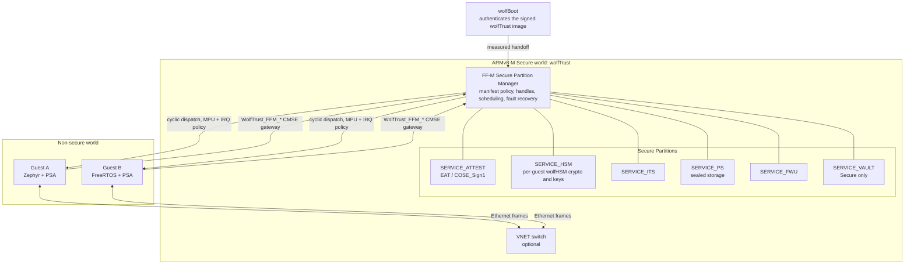

# wolfTrust

wolfTrust is an on-chip secure runtime for ARMv8-M TrustZone-M systems. It runs
in the Secure world in place of TF-M: wolfBoot authenticates the wolfTrust
image, wolfTrust hosts a Firmware Framework for M (FF-M) Secure Partition
Manager (SPM) with PSA services, and fixed Non-secure guests reach those
services through one mediated gateway. The reference target is the STM32H563
(Cortex-M33), with Zephyr and FreeRTOS as the reference guests.

Underneath the PSA service layer, wolfTrust is still a static-partition design.
It time-slices fixed Non-secure guests, restores each guest after preemption,
and contains guest faults according to a configured restart policy. ARMv8-M
TrustZone does not provide full peer virtualization, so wolfTrust combines the
SAU and STM32 firewalls (GTZC) with a Non-secure MPU envelope that is reloaded
on every guest dispatch. It is not an MMU hypervisor for general-purpose
operating systems.

## One mediated path

Every request from a Non-secure guest crosses the same CMSE gateway. The
gateway stamps the caller identity from the active guest (the guest never
supplies its own), copies and range-checks the input and output vectors, and
hands them to the SPM, which dispatches to a Secure Partition. The default
Secure build exports only the five `WolfTrust_FFM_*` veneers, and a build-time
symbol check rejects any other Non-secure-callable veneer.

## Architecture



The SPM owns caller identity, message handles, queues, signals, and the Secure
scheduler timer. Each guest has fixed flash, RAM, peripheral, and IRQ
assignments. On a timer tick the monitor captures the current Non-secure
context, installs the next guest's MPU and IRQ envelope, and resumes it at the
exact preemption point. wolfHSM work runs in Secure tasklets rather than on the
SysTick stack, and each guest has its own server context.

See [docs/architecture.md](docs/architecture.md) for the boot chain, exception
paths, service design, and the current isolation boundaries.

## Services

[`port/stm32h563/manifest.json`](port/stm32h563/manifest.json) is the
authoritative service list for the reference port.

| Service | Job | Non-secure access |
| --- | --- | :---: |
| `SERVICE_ATTEST` | Initial Attestation; EAT claims in a wolfCOSE `COSE_Sign1`, IAK held in wolfHSM | Yes |
| `SERVICE_HSM` | Relay for guest wolfHSM packets and secure crypto | Yes |
| `SERVICE_ITS` | Internal Trusted Storage, namespaced by caller | Yes |
| `SERVICE_PS` | AES-GCM sealed storage with rollback binding | Yes |
| `SERVICE_FWU` | Stages and arms an image for wolfBoot's update flow | Yes |
| `SERVICE_VAULT` | Key, object, counter, and entropy backend for Secure callers | No |

Guest crypto flows through PSA Crypto, wolfPSA, a wolfCrypt crypto callback, and
the wolfHSM client, which sends exactly one `psa_call` per wolfHSM packet to
`SERVICE_HSM`. The SPM-stamped identity selects a per-guest wolfHSM server, so
each guest has its own key namespace over a shared Secure NVM backend.

## Boot chain and guest launch

1. wolfBoot authenticates the signed wolfTrust image and hands off the image
   measurement, version, and device lifecycle.
2. wolfTrust validates the generated manifest, starts the SPM and service
   dispatchers, and initializes wolfHSM-backed state.
3. Before a guest enters its Non-secure domain, wolfTrust hashes the guest's
   executable window and checks the digest and version against a record pinned
   into the signed wolfTrust image.
4. A verified guest runs. Version floors persist in wolfHSM-backed NVM; a failed
   check quarantines that guest according to the restart policy.

## Requirements

The standard build and emulator demos require:

- GNU Make and a host C compiler
- an `arm-none-eabi-` GCC toolchain with CMSE support
- [`m33mu`](https://github.com/danielinux/m33mu) on `PATH` for the STM32H563
  emulator tests

The dependencies in `lib/` are Git submodules. Their configured URLs use SSH,
so GitHub SSH access must be set up before initializing them.

## Quick start

Clone the repository with its dependencies, then build the Secure firmware:

```sh
git clone --recurse-submodules git@github.com:wolfSSL/wolftrust.git
cd wolftrust
make
```

For an existing checkout:

```sh
git submodule update --init --recursive
make
```

The default build targets `ARCH=armv8m TARGET=stm32h563` and produces:

- `build/wolftrust.elf`, the Secure ELF with symbols
- `build/wolftrust.bin`, the loadable Secure image
- `build/secure_cmse_implib.o`, the CMSE import library used to link guests to
  the NSC veneers

Run the two-guest bare-metal demo under `m33mu`:

```sh
make run-stm32h563-uarts
```

Both guests are independently scheduled and write to their assigned UARTs. They
exercise wolfHSM-backed RNG, AES-CBC, ECC, persistent key storage, and the
wolfCrypt benchmark path. For direct emulator output or its TUI, use
`make run-stm32h563` or `make run-stm32h563-tui`.

## Tests and demos

The project uses three evidence tiers: host unit suites, the STM32H563 M33MU
emulator, and STM32H563 silicon. A pass in one tier is not renamed as a pass in
another. See [docs/testing.md](docs/testing.md) for the full map.

```sh
make test              # host unit and integration suites
make test-target       # baseline M33MU scenarios (skips if m33mu is absent)
make test-conformance  # Arm FF-M conformance on M33MU, host subset without it
make test-hardware     # STM32H563 silicon scenarios (skips without a board)
```

#### wolfIP virtual network support

Two isolated Non-secure guests can exchange real Ethernet and TCP/IP traffic
([wolfIP](https://github.com/wolfSSL/wolfip)) through the Secure world, entirely
mediated by the FF-M SPM. Guests reach the switch only through `psa_connect` and
`psa_call` to `SERVICE_VNET` — no raw Non-secure-callable veneer exists, so the
capability adds no second attack surface. It is off by default and compiled in
only with `CONFIG_VNET=y`.

Run the wolfIP virtual network tests, most-portable first:

```sh
make test-vnet           # host: Ethernet switch dataplane + mediated SERVICE_VNET round trip
make test-vnet-target    # M33MU emulator: two wolfIP guests ping through SERVICE_VNET (skips without m33mu)
make test-vnet-hardware  # STM32H563 silicon: the same end-to-end ping on a board (skips without one)
```

`make test-vnet-target` builds the Secure image with `CONFIG_VNET=y`, launches
two authenticated bare-metal wolfIP guests, and asserts that guest A receives an
ICMP echo reply from guest B through the mediated switch. `make test-vnet`
proves the Ethernet dataplane and the `guest0 -> SERVICE_VNET -> switch ->
guest1` delivery path on the host with no hardware. All three also run in CI (the
host suites as `vnet`/`vnet_relay` units, the emulator scenario as the `vnet`
M33MU scenario).

### Zephyr, PSA, FreeRTOS, and PKCS#11

The advanced integration lives in `tests/firmware/zephyr-stm32h5`. Its setup
downloads a narrow Zephyr workspace and installs `west` and `pyelftools` in a
local Python virtual environment, so it additionally needs Python 3 with `venv`,
CMake, Ninja, and network access.

```sh
cd tests/firmware/zephyr-stm32h5

make run-uarts               # Zephyr/PSA guest A, bare-metal guest B
make zephyr-freertos-uarts   # Zephyr/PSA guest A, FreeRTOS/wolfPKCS11 guest B
```

The first invocation creates the ignored `.venv/` and `.workspace/` trees and
applies the repository's Zephyr patches. These demos use `m33mu` and also expose
`run` and `run-tui` targets.

## Configuration

Build settings are Make variables and can be overridden on the command line.
Common options include:

| Variable | Default | Purpose |
| --- | ---: | --- |
| `ARCH` | `armv8m` | Secure architecture (currently the only supported value) |
| `TARGET` | `stm32h563` | Platform port (currently the only supported value) |
| `WT_MAX_GUESTS` | `2` | Number of configured guests |
| `WT_TIMESLICE_MS` | `2` | Static scheduler timeslice |
| `WT_CO_STACK_SIZE` | `24576` | Secure tasklet stack size in bytes |
| `WT_ENGINE_HSM` | `1` | Include the wolfHSM service |
| `CONFIG_VNET` | `n` | Build the wolfIP virtual network as the `SERVICE_VNET` FF-M partition |
| `TOOLPREFIX` | `arm-none-eabi-` | Cross-toolchain command prefix |
| `M33MU` | `m33mu` | Emulator command or path |

For example:

```sh
make WT_TIMESLICE_MS=5 WT_MAX_GUESTS=1
make clean
make CONFIG_VNET=y
```

The STM32H563 partition table and memory assignments are defined in
`port/stm32h563/partitions.c` and `port/stm32h563/memory_map.h`. Changing the
guest count or placement also requires matching guest linker and emulator load
settings. The full list of interfaces a port supplies is in
[docs/port-contract.md](docs/port-contract.md).

## Repository layout

- `include/wolftrust/` monitor, partition, service, FF-M, scheduling, and VNET
  APIs
- `src/monitor.c` generic cyclic scheduler, dispatch, and fault recovery
- `src/ffm.c`, `src/ffm_boot.c` FF-M SPM runtime and service registration
- `src/arch/armv8m/` CMSE FF-M gateway, SPM service entry, and context switching
- `src/client/` OS-neutral PSA/FF-M client core and the wolfHSM PSA transport
- `src/services/` attestation, storage, firmware update, wolfHSM relay, vault,
  and VNET partition code
- `src/sched/`, `src/sync/`, `src/vnet/` scheduler, sync primitives, and the
  virtual Ethernet data plane
- `port/stm32h563/` SAU/GTZC/MPU/NVIC setup, partitions, flash, TRNG, and the
  generated manifest
- `docs/` user documentation and the `requirements/` traceability ledger
- `tests/host/` native unit and integration suites
- `tests/target/` M33MU and STM32H563 scenario runners
- `tests/firmware/` bare-metal, VNET, Zephyr, PSA, FreeRTOS, and PKCS#11 demos
- `lib/` wolfSSL ecosystem dependencies, included as submodules

## Documentation

- [docs/architecture.md](docs/architecture.md) boot chain, Secure/Non-secure
  split, SPM, services, and the guest crypto path
- [docs/security-model.md](docs/security-model.md) what hardware, build checks,
  and tests enforce, plus the current limits
- [docs/building.md](docs/building.md) toolchain, container, useful targets, and
  the knobs a first build needs
- [docs/testing.md](docs/testing.md) the host, M33MU, and silicon evidence tiers
- [docs/port-contract.md](docs/port-contract.md) and
  [docs/adding-a-port.md](docs/adding-a-port.md) the port interfaces and the
  bring-up checklist
- [docs/requirements/](docs/requirements/) the normative requirement IDs,
  approved sources, and validation records

## Current status and security scope

The STM32H563 port exercises the authenticated wolfBoot to wolfTrust chain,
the FF-M SPM and PSA services, timer-preemptive guest switching with per-dispatch
Non-secure MPU and IRQ policy, guest restart handling, per-guest wolfHSM crypto
and key isolation, sealed storage, measured guest launch, anti-rollback, and
graceful Secure Partition fault recovery. The monitor is freestanding and uses
no heap in the Secure domain.

The manifest selects FF-M isolation profile 3, which is the policy target rather
than proof that every partition shares one hardware boundary. TrustZone enforces
the Secure and Non-secure split, and the Secure MPU confines the unprivileged
partition loops; some service loops currently run privileged, and attestation is
dispatched inline. wolfTrust passes the Arm PSA Certified API test suites (FF-M
plus the Crypto, Storage, and Initial Attestation dev_apis) on the emulator and
on silicon; that is the technical basis for API certification and not a PSA
Certified mark by itself. See [docs/security-model.md](docs/security-model.md)
for the exact claim boundaries before treating a deployment as production-ready.

## License

wolfTrust is licensed under the [GNU General Public License v3.0](LICENSE).
The submodules under `lib/` retain their own licenses.
