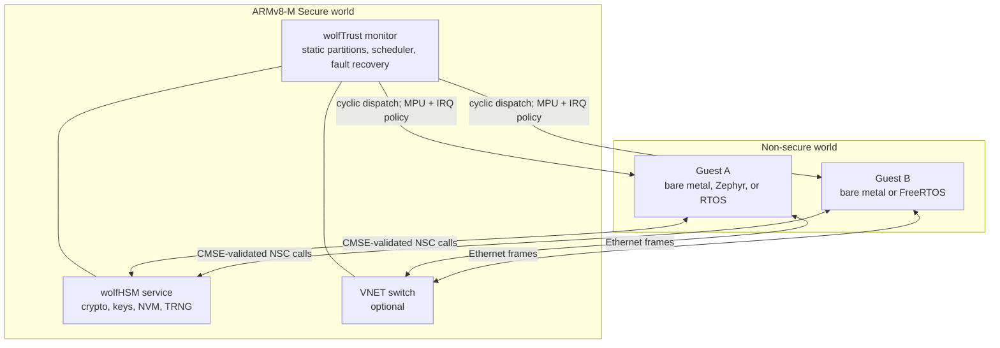

# wolfTrust

wolfTrust is a small, static separation kernel for ARMv8-M TrustZone systems.
It runs in the Secure world, time-slices fixed Non-secure guests, restores each
guest after preemption, and contains guest faults according to a configured
restart policy. The reference target is the STM32H563 (Cortex-M33).

The Secure image also provides services that guests reach through
Non-secure Callable (NSC) veneers:

- a per-guest [wolfHSM](https://github.com/wolfSSL/wolfHSM) crypto and keystore
  server, backed by shared Secure flash and the STM32H5 TRNG;
- an optional virtual Ethernet switch with a copy-based guest ABI and virtual
  RX interrupt; and
- integration examples for Zephyr's TEE API, PSA Crypto, FreeRTOS, and
  wolfPKCS11.

This is intended for fixed RTOS-style partitions. ARMv8-M TrustZone does not
provide full peer virtualization, so wolfTrust combines the SAU and STM32
firewalls with a Non-secure MPU configuration that is reloaded on every guest
dispatch. It is not an MMU hypervisor for general-purpose operating systems.

## Architecture



The monitor owns partition metadata, the Secure scheduler timer, memory
attribution, and guest-visible IRQ policy. Each guest has fixed flash, RAM,
peripheral, and IRQ assignments. On a timer tick the monitor captures the
current Non-secure context, installs the next guest's MPU and IRQ envelope,
and resumes it at the exact preemption point.

wolfHSM work runs in Secure tasklets rather than on the SysTick stack. Each
guest has its own server context and a validated 512-byte transport window;
the server contexts share a mutex-protected NVM backend. The STM32H563 port
stores mirrored NVM data in two 8 KiB sectors at the end of flash bank 2.

See [docs/architecture.md](docs/architecture.md) for the exception paths,
guest ABI, service design, porting requirements, and current security limits.

## Requirements

The standard build and emulator demos require:

- GNU Make and a host C compiler;
- an `arm-none-eabi-` GCC toolchain with CMSE support; and
- [`m33mu`](https://github.com/danielinux/m33mu) on `PATH` for the STM32H563
  emulator tests.

The dependencies in `lib/` are Git submodules. Their configured URLs use SSH,
so GitHub SSH access must be set up before initializing them.

## Quick start

Clone the repository with its dependencies, then build the Secure firmware:

```sh
git clone --recurse-submodules git@github.com:wolfSSL/wolftrust.git
cd wolftrust
make
```

For an existing checkout:

```sh
git submodule update --init --recursive
make
```

The default build targets `ARCH=armv8m TARGET=stm32h563` and produces:

- `build/wolftrust.elf` — Secure ELF with symbols;
- `build/wolftrust.bin` — loadable Secure image; and
- `build/secure_cmse_implib.o` — CMSE import library used to link guests to
  the NSC veneers.

Run the two-guest bare-metal demo under `m33mu`:

```sh
make run-stm32h563-uarts
```

Both guests are independently scheduled and write to their assigned UARTs.
They exercise wolfHSM-backed RNG, AES-CBC, ECC, persistent key storage, and
the wolfCrypt benchmark path. For direct emulator output or its TUI, use
`make run-stm32h563` or `make run-stm32h563-tui`.

## Tests and demos

Run the fast host tests without an ARM emulator:

```sh
# VNET frame pool, rings, FDB, MAC handling, and switching
make test-vnet-host

# In-memory wolfHSM client/server loopback (RNG and ECC signing)
make -C tests/host/wolfhsm_loopback run
```

Run the end-to-end virtual-network demo:

```sh
make run-stm32h563-vnet
```

This builds the Secure image with `CONFIG_VNET=y`, launches two bare-metal
guests with wolfIP, and verifies that guest A receives an ICMP echo reply from
guest B through the Secure virtual switch. VNET is disabled in the normal
Secure build unless `CONFIG_VNET=y` is supplied.

### Zephyr, PSA, FreeRTOS, and PKCS#11

The advanced integration lives in `tests/firmware/zephyr-stm32h5`. Its setup
downloads a narrow Zephyr v4.2.0 workspace and installs `west` and
`pyelftools` in a local Python virtual environment, so it additionally needs
Python 3 with `venv`, CMake, Ninja, and network access.

```sh
cd tests/firmware/zephyr-stm32h5

# Zephyr guest A uses both the TEE API and PSA Crypto; guest B is bare metal
make run-uarts

# Zephyr/PSA guest A plus FreeRTOS/wolfPKCS11 guest B
make zephyr-freertos-uarts
```

The first invocation creates the ignored `.venv/` and `.workspace/` trees and
applies the repository's Zephyr patches. These demos use `m33mu`; the scripts
also expose `run` and `run-tui` targets.

## Configuration

Build settings are Make variables and can be overridden on the command line.
Common options include:

| Variable | Default | Purpose |
| --- | ---: | --- |
| `ARCH` | `armv8m` | Secure architecture (currently the only supported value) |
| `TARGET` | `stm32h563` | Platform port (currently the only supported value) |
| `WT_MAX_GUESTS` | `2` | Number of configured guests |
| `WT_TIMESLICE_MS` | `2` | Static scheduler timeslice |
| `WT_CO_STACK_SIZE` | `24576` | Secure tasklet stack size in bytes |
| `WT_ENGINE_HSM` | `1` | Include the wolfHSM service |
| `CONFIG_VNET` | `n` | Include the Secure VNET data plane and veneers |
| `TOOLPREFIX` | `arm-none-eabi-` | Cross-toolchain command prefix |
| `M33MU` | `m33mu` | Emulator command or path |

For example:

```sh
make WT_TIMESLICE_MS=5 WT_MAX_GUESTS=1
make clean
make CONFIG_VNET=y
```

The STM32H563 partition table and memory assignments are defined in
`src/port/stm32h563/partitions.c` and `src/port/stm32h563/memory_map.h`.
Changing the guest count or placement also requires matching guest linker and
emulator load settings.

## Repository layout

- `include/wolftrust/` — monitor, partition, service, scheduling, and VNET APIs.
- `src/monitor.c` — generic cyclic scheduler, dispatch, and fault recovery.
- `src/arch/armv8m/` — CMSE validation and Secure tasklet context switching.
- `src/port/stm32h563/` — SAU/GTZC/MPU/NVIC setup, partitions, flash, and TRNG.
- `src/services/wolfhsm/` — per-guest wolfHSM server and Secure runner.
- `src/vnet/` and `src/services/vnet/` — virtual Ethernet data plane and NSC service.
- `tests/host/` — native VNET and wolfHSM tests.
- `tests/firmware/` — bare-metal, VNET, Zephyr, PSA, FreeRTOS, and PKCS#11 demos.
- `lib/` — wolfSSL ecosystem dependencies, included as submodules.

## Current status and security scope

The STM32H563 port exercises timer-preemptive guest switching, per-dispatch
Non-secure MPU and IRQ policy, guest restart handling, wolfHSM services, and
virtual networking under `m33mu`. The monitor is freestanding, uses no heap in
the Secure domain, and validates guest service pointers with both partition
metadata and CMSE range checks.

This repository is still a reference implementation. Stronger peer isolation
through additional SoC-specific firewalls and richer Secure fault audit
logging remain open work. Review the threat model and port-specific memory and
interrupt attribution before treating a deployment as production-ready.

## License

wolfTrust is licensed under the [GNU General Public License v3.0](LICENSE).
The submodules under `lib/` retain their own licenses.
